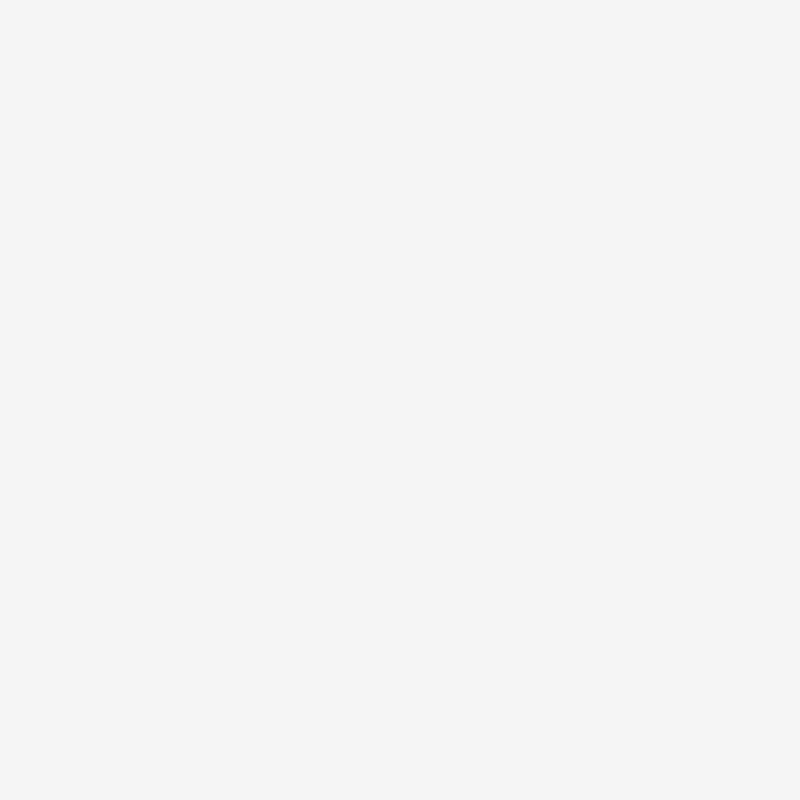
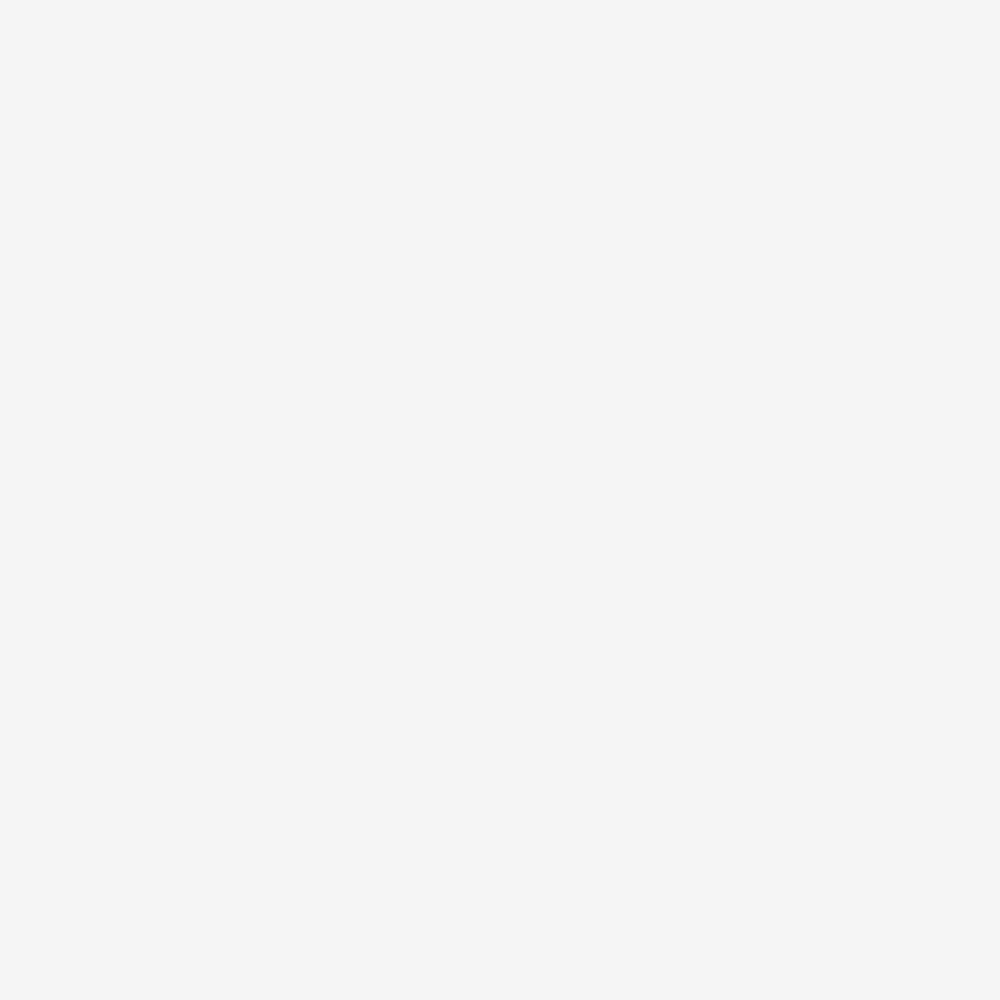
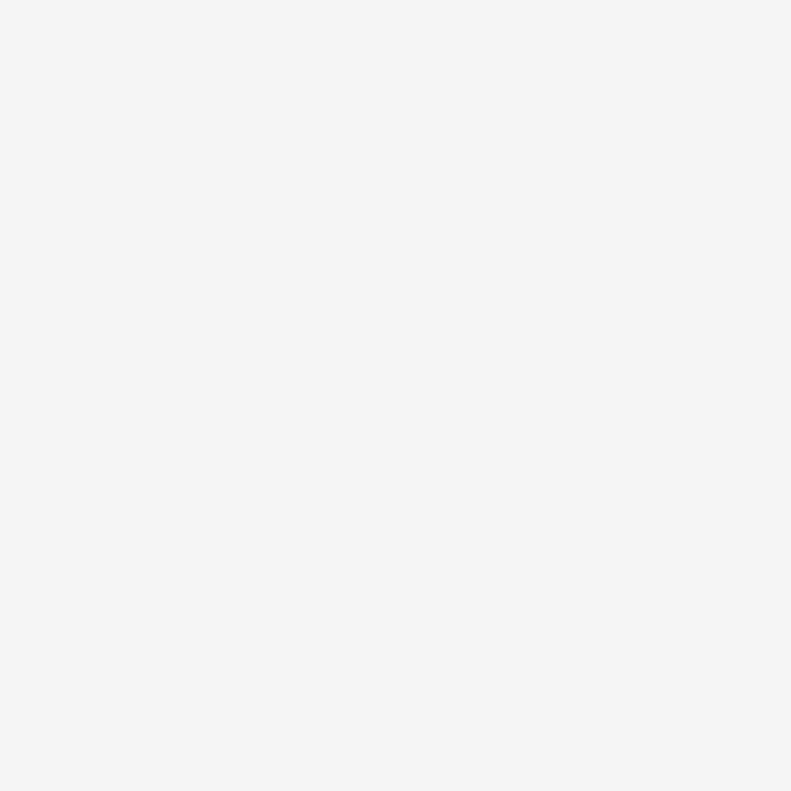
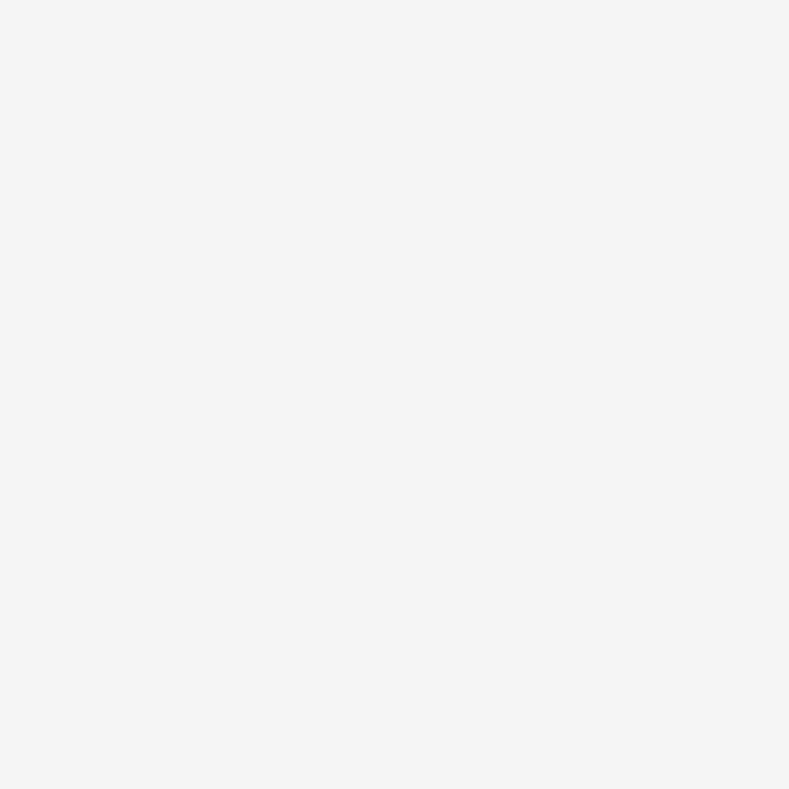
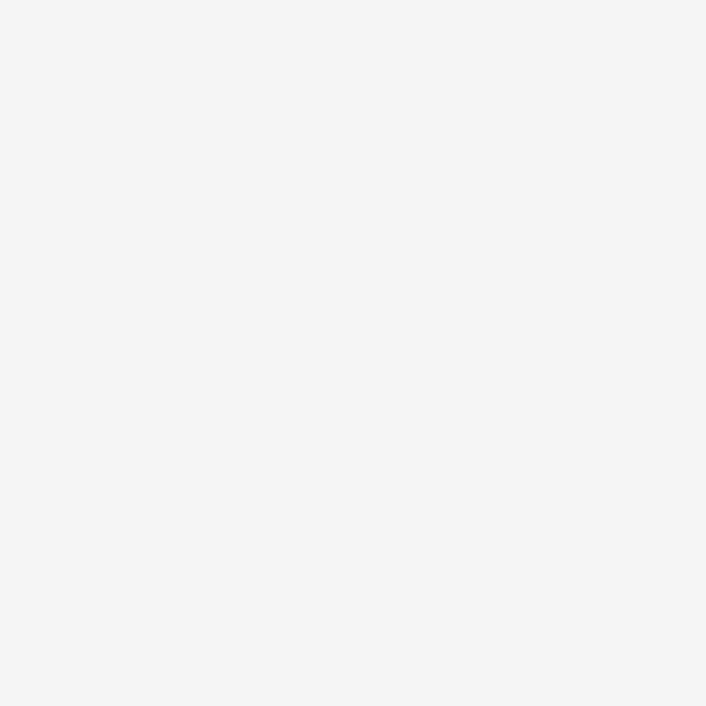
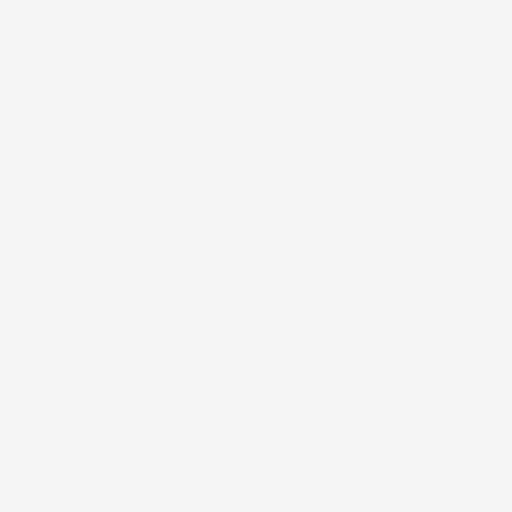
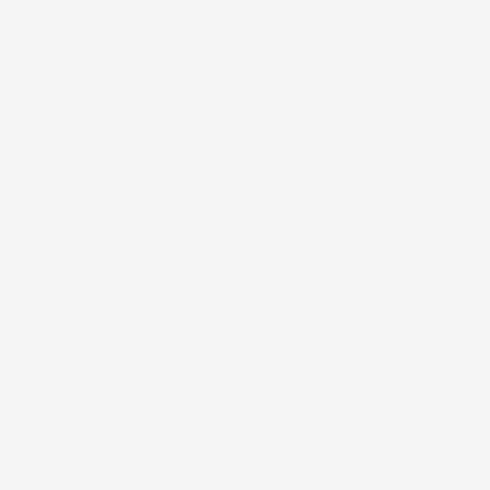
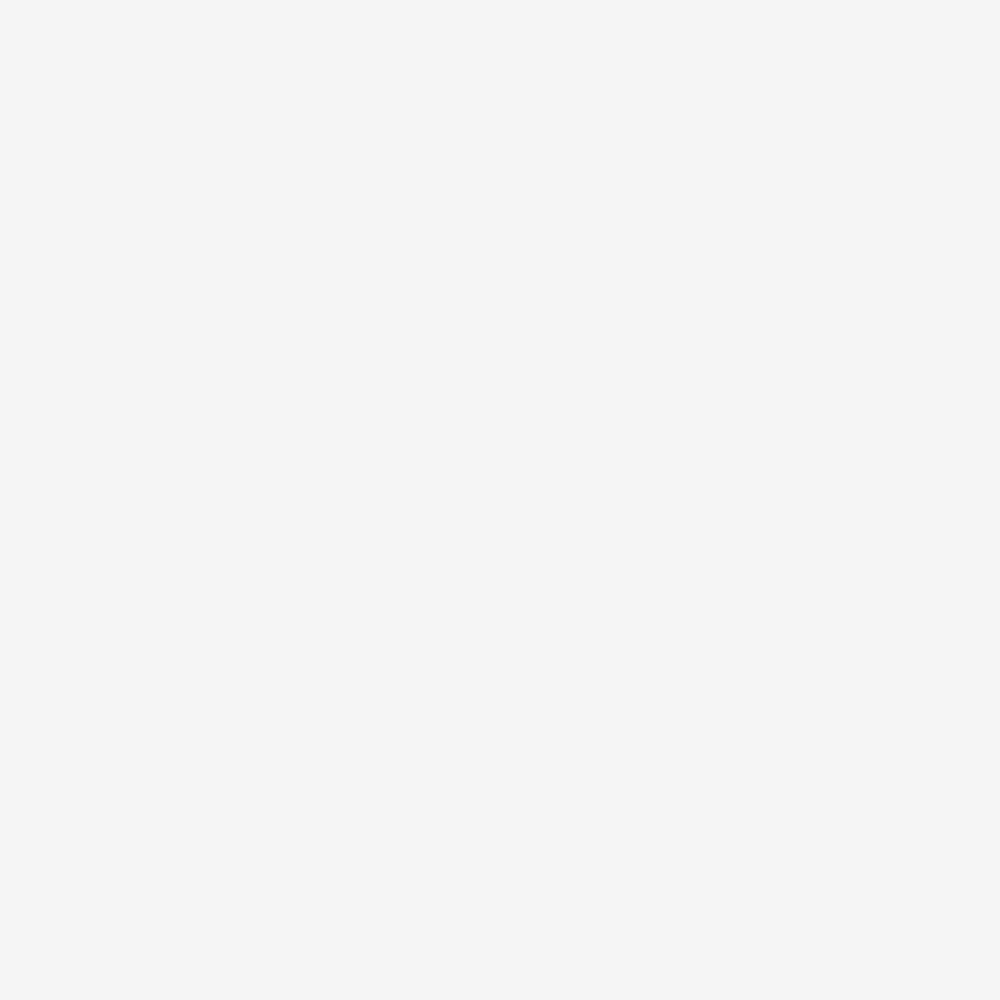
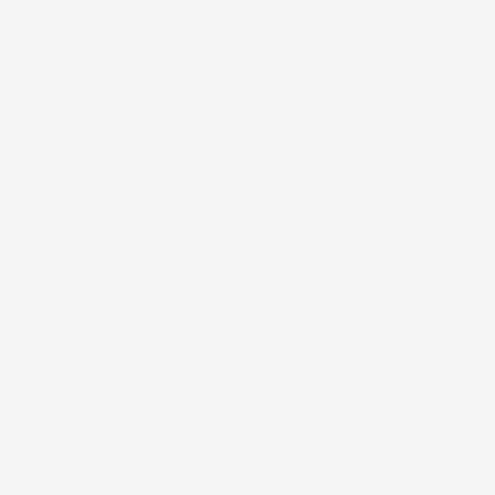

# Northstar Supply

Northstar Supply is a production-style ASP.NET Core MVC commerce demo built to showcase the kinds of application patterns and workflows used in recent .NET work that cannot be shared publicly because of NDA coverage. The application combines a customer storefront, authenticated checkout flow, order lifecycle management, and an admin back office in a single public-facing repository designed to represent maintainable, real-world business application structure rather than a tutorial-only sample.

This repository focuses on the engineering value behind a polished commerce application: separated customer and admin concerns, database-backed catalog and order workflows, role-aware access control, seeded demo content, and payment integration through Stripe test mode.

## Preview



## Key Features

- Customer-facing storefront with category-based product browsing and product detail pages
- Shopping cart flow with quantity management and session-backed cart state
- Stripe Checkout integration for card payments in test mode
- Order confirmation, order history, and order detail views for signed-in users
- Role-based application flows for `Admin`, `Employee`, `Company`, and `Customer`
- Delayed-payment path for company-backed accounts
- Admin CRUD workflows for products, categories, companies, and user accounts
- Product image management, including upload, duplicate detection, and display-order controls
- Seeded catalog, category, company, role, and initial admin data for local demo setup

## Tech Stack

- .NET 8
- ASP.NET Core MVC
- Razor Views and Razor Pages
- Entity Framework Core with SQL Server
- ASP.NET Core Identity
- Stripe.net
- Bootstrap 5
- jQuery

## Application Overview

Northstar Supply is organized as a multi-project solution with a conventional MVC web front end and separate data, model, and utility layers:

- `Northstar.Web` hosts the ASP.NET Core MVC application, Razor views, area-based controllers, static assets, and Identity UI.
- `Northstar.DataAccess` contains the EF Core `DbContext`, migrations, seeding, repository implementations, unit-of-work coordination, and Stripe checkout helpers.
- `Northstar.Models` defines the domain entities and view models used across storefront, cart, order, and admin workflows.
- `Northstar.Utility` holds shared constants, role/status definitions, controller helpers, and the email sender stub used by Identity.

From an application architecture perspective, the repository separates customer-facing and admin-facing concerns through ASP.NET Core Areas (`Customer`, `Admin`, and `Identity`). Persistence is handled with EF Core against SQL Server, while authentication and authorization are handled with ASP.NET Core Identity and role checks across storefront, order, and admin paths. The application seeds catalog content directly through the `DbContext` model configuration, then creates roles and an initial admin account during startup initialization.

## Why This Project Exists

Much of my recent .NET work is under NDA, so I built this public demo to showcase the kinds of technologies, workflows, and application structures I typically work with. The goal is not to present a fictional client deployment, but to provide a credible, reviewable example of how I approach business application architecture, feature delivery, and code organization in a public repository.

## Screenshots

### Product Details



### Shopping Cart



### Order Summary



### Customer Order Details



### Admin Product Management



### Product Upsert



### Admin Orders



### Admin Order Details



## Running Locally

### Prerequisites

- .NET 8 SDK
- SQL Server or SQL Server LocalDB

### Setup

1. Clone the repository.
2. Open the solution at `Northstar.Web/Northstar.sln`.
3. Configure a valid SQL Server connection string in `Northstar.Web/appsettings.json` under `ConnectionStrings:DefaultConnection`, or provide it through the `ConnectionStrings__DefaultConnection` environment variable.
4. Configure Stripe test keys under the `Stripe` section in `Northstar.Web/appsettings.json`. For a cleaner local setup, move these into user secrets or environment variables.
5. Apply migrations:

```powershell
dotnet ef database update --project Northstar.DataAccess/Northstar.DataAccess.csproj --startup-project Northstar.Web/Northstar.Web.csproj
```

6. Run the web app:

```powershell
dotnet run --project Northstar.Web/Northstar.Web.csproj
```

The app applies pending migrations on startup and runs database initialization that creates roles and a default admin account if they do not already exist.

## Demo Notes

- The catalog, categories, companies, product images, roles, and an initial admin user are seeded for local demo use.
- Stripe is wired for test-mode checkout and should be exercised with test credentials only.
- Identity email sending is stubbed with a no-op `IEmailSender` implementation, so email-dependent flows are not configured for real delivery in this demo.

## Future Improvements

- Add automated test coverage around storefront, checkout, and admin workflows
- Expand catalog filtering and search capabilities
- Publish a hosted demo environment
